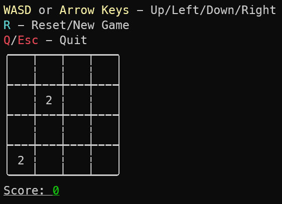

# game_2048
Very basic terminal-based clone of [2048](http://gabrielecirulli.github.io/2048/).

## Screenshot


## Usage
```./game_2048``` - starts the game with default settings (4x4 grid with 2 tiles filled)

```./game_2048 5 6 3``` - starts the game with custom configuration (5x6 grid with 3 tiles fillled)

```./game_2048 --help``` - shows the help message

## Controls
* **WASD** and **Arrow Keys** - movement
* **R** - reset/new game
* **Q/Esc** - quits the game